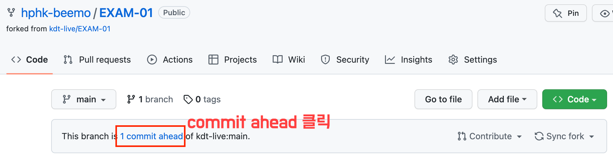
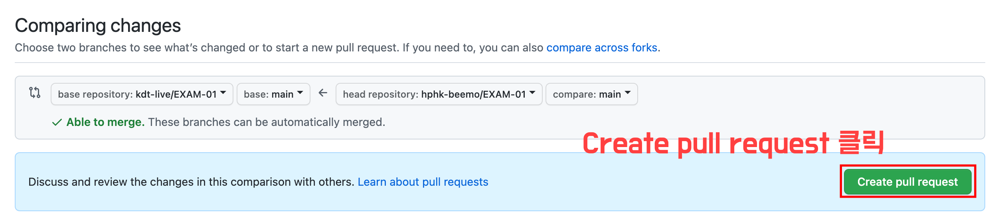
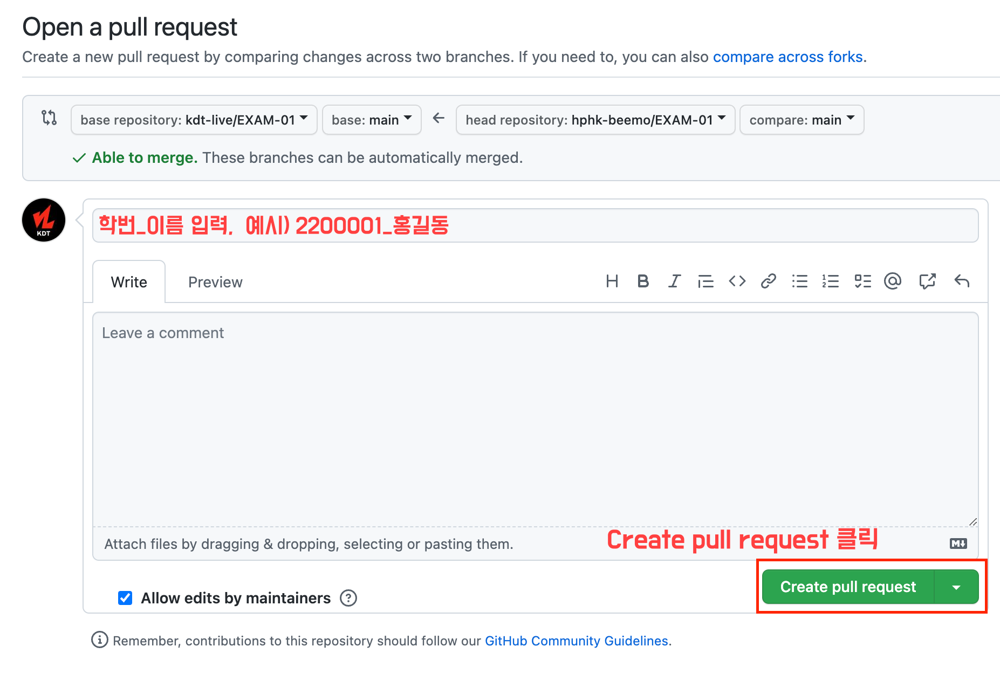

# 문제 해결 능력 평가

## 목적
> 파이썬을 활용한 알고리즘 문제 해결 능력 평가

## Github Pull Request 생성 안내
1. 현재 저장소 `Fork`
2. `Fork` 수행 후 본인 저장소 목록에 생성된 저장소 `clone` 
3. 아래 규칙에 맞춰 문제 풀이 코드 작성
	1. `본인 학번` 폴더 생성 (학번은 공지사항을 통해 확인)
	2. 문제 코드 파일 생성 및 코드 작성 
	3. `Readme.md` 파일 생성하고, 모의고사 후기 작성
   - 폴더 구조 예시
	   ```plain
	   2200001/
	       문제1.py
		   문제2.py
		   문제3.py
	       ...
	       Readme.md
	   ```
4. `add` `commit`  `push` 수행
5. 깃허브 원격 저장소 접속 후 `Pull Request` 수행 [아래 이미지 참고]





